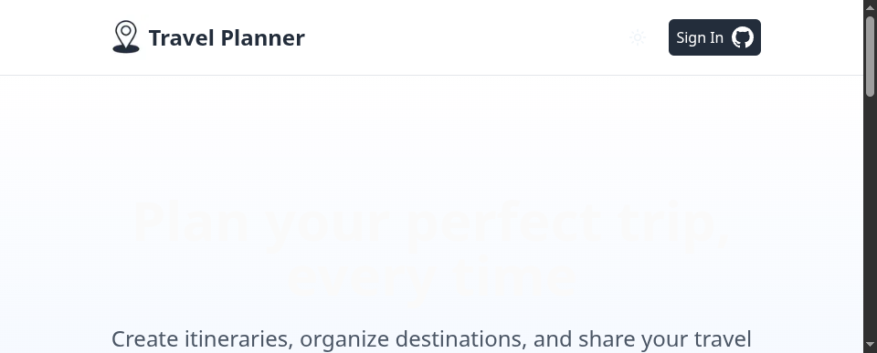
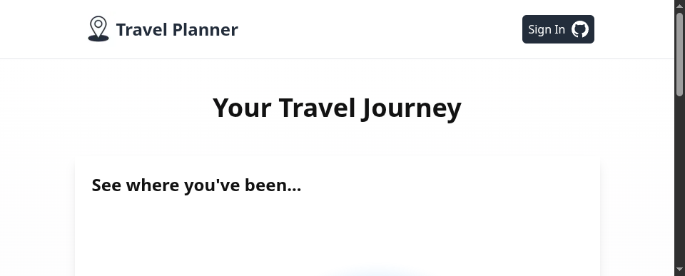

# AI Travel Planner

An AI-powered travel planning application built with **Next.js 16**, **React 19**, **Prisma**, **NextAuth 5**, and **OpenRouter**. Generate intelligent itineraries, get location suggestions, receive insider tips, chat with an AI travel assistant, and visualize your journeys on interactive maps and a 3D globe.

Live demo: https://ai-travel-planner-azure-chi.vercel.app/

## Features

### Core
- **Trip Management** — Create, edit, clone, and delete trips (owner-scoped)
- **Drag & Drop Itinerary** — Reorder destinations with `@dnd-kit`
- **Inline Location Editing** — Rename any destination without leaving the page
- **Interactive Maps** — Visualize destinations with Google Maps
- **3D Globe** — See your travel journey on an interactive globe (auto-rotating)
- **Image Upload** — Upload trip cover images via UploadThing
- **Public Share Link** — Generate a read-only `/shared/[tripId]` page
- **Print / PDF Export** — Printer-optimized `/trips/[tripId]/print` view
- **Dashboard Search** — Filter trips instantly by title or description
- **Dark Mode** — Toggle light/dark with a no-flash theme switcher

### AI (powered by OpenRouter)
- **AI Itinerary Generator** — Day-by-day itineraries with activities and budget breakdown
- **AI Location Suggester** — Smart location recommendations for your trip
- **AI Trip Summary** — Auto-generated summary, packing list, and budget estimate
- **AI Location Tips** — Per-destination insider tips, must-tries, and what to avoid
- **AI Travel Chat** — Streaming chat assistant with live trip context

### Engineering
- **GitHub OAuth** — Sign in via NextAuth 5
- **Rate Limiting** — In-memory sliding window on all AI endpoints (`X-RateLimit-Remaining`)
- **Input Validation** — Structured validation on trip creation/update APIs
- **Error Handling** — Error boundaries, loading states, not-found pages
- **Retry Logic** — Exponential backoff for OpenRouter API calls (3 retries)
- **Robust AI JSON Parsing** — Strips code fences / prose and extracts balanced JSON

## Screenshots

| Landing (light) | Landing (dark) | 3D Globe |
|---|---|---|
|  |  |  |

> The trip detail page (AI itinerary, summary, per-location tips, streaming
> chat, edit, share, print) and dashboard require GitHub sign-in. After
> authenticating you get the full AI-assisted planning experience.

## Tech Stack

| Layer | Technology |
|---|---|
| Framework | Next.js 16 (App Router, Turbopack) |
| UI | React 19, Tailwind CSS 4, shadcn/ui-style primitives |
| Database | PostgreSQL with Prisma 6 |
| Auth | NextAuth 5 (GitHub OAuth) |
| AI | OpenRouter API (Gemini, Claude, GPT, etc.) |
| Maps | @react-google-maps/api |
| Globe | react-globe.gl + Three.js |
| File Upload | UploadThing |
| DnD | @dnd-kit |
| Testing | Vitest + React Testing Library |
| Language | TypeScript |

## Getting Started

### Prerequisites
- Node.js 18+ (Node 20+ recommended)
- PostgreSQL database
- OpenRouter API key
- GitHub OAuth App credentials

### Setup

```bash
git clone git@github.com:MohammadMuntasirKabir/ai-travel-planner.git
cd ai-travel-planner
npm install
cp .env.example .env.local
```

Fill in `.env.local`:
- `DATABASE_URL` — your PostgreSQL connection string
- `AUTH_SECRET` — generate with `openssl rand -base64 32`
- `AUTH_GITHUB_ID` / `AUTH_GITHUB_SECRET` — from your GitHub OAuth app
- `OPENROUTER_API_KEY` — from https://openrouter.ai/keys
- `NEXT_PUBLIC_GOOGLE_MAPS_API_KEY` — from Google Cloud (Maps JavaScript API)
- `UPLOADTHING_TOKEN` — optional, from https://uploadthing.com

Then run migrations and start:

```bash
npx prisma migrate dev
npm run dev
```

Open http://localhost:3003

### Environment Variables

| Variable | Required | Purpose |
|---|---|---|
| `DATABASE_URL` | Yes | PostgreSQL connection |
| `AUTH_SECRET` | Yes | NextAuth session encryption |
| `AUTH_GITHUB_ID` | Yes | GitHub OAuth client id |
| `AUTH_GITHUB_SECRET` | Yes | GitHub OAuth client secret |
| `OPENROUTER_API_KEY` | Yes | AI provider key |
| `OPENROUTER_MODEL` | No | Defaults to `openai/gpt-oss-20b:free` |
| `NEXT_PUBLIC_GOOGLE_MAPS_API_KEY` | Yes (maps) | Google Maps + geocoding |
| `GOOGLE_MAPS_API_KEY` | No | Server-only geocoding key (falls back to public) |
| `UPLOADTHING_TOKEN` | No | Image uploads |

## Scripts

```bash
npm run dev          # Start dev server (Turbopack)
npm run build        # Production build
npm start            # Serve production build
npm run lint         # Biome check + Stylelint
npm run lint:fix     # Auto-fix lint issues
npm run format       # Format with Biome
npm test             # Run all tests (Vitest)
npm run test:watch   # Watch mode
npm run test:coverage
```

## Testing

**91 tests** across 14 files covering the AI client, prompt templates, all API routes,
server actions, JSON parsing, rate limiting, and schema validation.

## Project Structure

```
ai-travel-planner/
├── app/
│   ├── api/
│   │   ├── ai/                    # AI API routes (rate limited)
│   │   │   ├── chat/              # Streaming chat
│   │   │   ├── generate-itinerary/
│   │   │   ├── location-tips/
│   │   │   ├── suggest-locations/
│   │   │   └── summarize/
│   │   ├── auth/[...nextauth]/
│   │   ├── trips/                 # Trip CRUD + location delete
│   │   └── uploadthing/
│   ├── trips/                     # Trip pages
│   ├── shared/                    # Public read-only shared trip page
│   ├── globe/                     # 3D globe page
│   ├── error.tsx / loading.tsx / not-found.tsx
│   ├── layout.tsx                 # Root layout + theme boot script
│   └── page.tsx                   # Landing page
├── components/
│   ├── ai-panels.tsx              # Itinerary / summary / tips / suggestions UI
│   ├── trip-chat.tsx              # Streaming AI chat assistant
│   ├── edit-trip.tsx / edit-location.tsx
│   ├── trip-detail.tsx / trip-card.tsx / trip-search.tsx
│   ├── sortable-itinerary.tsx / map.tsx / navbar.tsx
│   ├── theme-toggle.tsx / auth-button.tsx
│   └── ui/                        # button, card, tabs primitives
├── lib/
│   ├── ai.ts                      # OpenRouter client + retry
│   ├── ai-prompts.ts              # Prompt templates
│   ├── actions/                   # Server actions (typed)
│   ├── prisma.ts / validation.ts / json.ts
│   ├── rate-limit.ts / rate-limit-middleware.ts
│   └── upload-thing.ts
├── prisma/                        # schema + migrations
└── tests/                         # Vitest suite
```

## License

MIT
